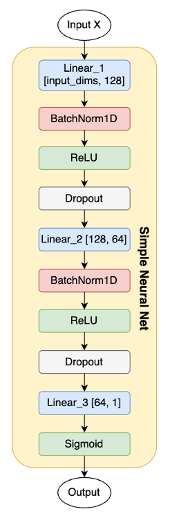
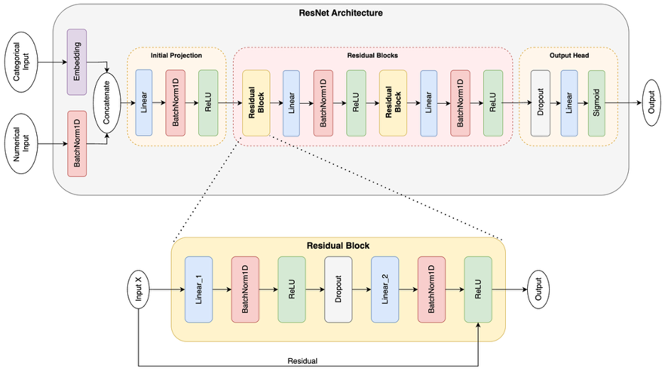

# UFC Fight Winner Prediction: Deep Learning with Entity Embeddings

## 📌 Project Overview
This project applies **Machine Learning (XGBoost, RF)** and **Deep Learning (ResNet, SimpleNN)** to predict the winner of UFC fights. 

While historical betting odds (Vegas) provide a strong baseline accuracy of **62.7%**, this project aims to surpass that threshold using data-driven methods. By leveraging a custom **ResNet architecture with Entity Embeddings** to handle high-cardinality categorical data (like fighting stance and weight class), the model achieved a validation accuracy of **67.0%** and correctly predicted **11 out of 13 fights (84.6%)** on a hold-out test card.

This repository is a fork of the [Ultimate UFC Dataset](https://github.com/shortlikeafox/ultimate_ufc_dataset). It extends the original data collection with a complete training pipeline, extensive EDA, and a research paper documenting the methodology.

---

## 📂 Repository Structure

| File | Description |
| :--- | :--- |
| `ufc_modeling.ipynb` | The core training pipeline. Contains preprocessing, PyTorch model definitions (SimpleNN & ResNet), training loops, and TensorBoard integration. |
| `ufc_full_eda.ipynb` | Comprehensive Exploratory Data Analysis. Visualizes win rates, physical advantages (reach/age), and betting market efficiency. |
| `ResNet_architecture.png` | Visualization of the custom Residual Network architecture. |
| `SimpleNN_architecture.png` | Visualization of the baseline Feed-Forward Neural Network. |
| `Predicting UFC Fight Outcomes Using AIML Models.pdf` | A detailed academic report on the methodology, architecture, and results of this project. |
| `ufc-master.csv` | The dataset used for training (ensure this is present or downloaded from the source). |

---

## 📊 Key Findings from EDA
Before modeling, an extensive analysis of the dataset revealed several domain-specific baselines:
* **The "Red Corner" Advantage:** Historically, the Red Corner (often the favorite/champion) wins **58%** of bouts.
* **Vegas Efficiency:** Simply betting on the favorite yields an accuracy of **62.7%**.
* **Physical Attributes:** Reach and Age differences significantly correlate with win probability, though "MMA Math" (transitive logic) often fails due to stylistic matchups.

---

## 🧠 Model Architectures

### 1. Simple Feed-Forward NN (Baseline)
A standard Multi-Layer Perceptron (MLP) processing **One-Hot Encoded** features. It uses a funnel structure (Linear $\rightarrow$ BatchNorm $\rightarrow$ ReLU $\rightarrow$ Dropout) to compress high-dimensional sparse inputs.

### 2. ResNet with Entity Embeddings (Best Performer)
To address the *Curse of Dimensionality* inherent in One-Hot Encoding, this model uses **Entity Embeddings** for categorical variables.
* **Dual Input Streams:** Separates Numeric inputs (scaled) and Categorical inputs (learned embeddings).
* **Residual Blocks:** Uses skip connections to allow for deeper network training without gradient degradation.
* **Feature Fusion:** Concatenates learned embeddings with numeric data before passing through the residual backbone.

---

## 📈 Results & Performance

We evaluated models on a chronological validation set. The Deep Learning approaches, particularly the ResNet variants, outperformed both the Red Corner and Betting Odds baselines.

| Rank | Model | Accuracy | Note |
| :--- | :--- | :--- | :--- |
| **1** | **ResNet_64_32** | **67.0%** | **Best Performer (beat Vegas Odds)** |
| 2 | XGBoost | 66.7% | Strongest ML Baseline |
| 3 | ResNet_128_64 | 66.4% | Hidden Layers -> [128, 64] |
| 4 | SimpleNN | 66.2% | Feed-Forward NN with norm, ReLU, and Dropout |
| 5 | ResNet_128_64 | 66.2% | Hidden Layers -> [128, 64] |
| 6 | Random Forest | 65.4% | |
| 7 | Logistic Regression | 65.1% | |
| 8 | SVC | 64.4% | |
| 9 | MLP | 57.2% | Simple MLP with only Linear Layers |
| *Ref* | *Vegas Odds* | *62.7%* | *Market Baseline* |
| *Ref* | *Red Corner* | *58.0%* | *Naive Baseline* |

### Real-World Case Study
The model was tested on an unseen fight card (**UFC Fight Night: Covington vs. Buckley**).
* **Accuracy:** 11/13 Correct Predictions (84.6%)
* **Calibration:** The model assigned high confidence (>70%) to clear winners and lower confidence (~50%) to close matchups like *Swanson vs. Quarantillo*.

---
